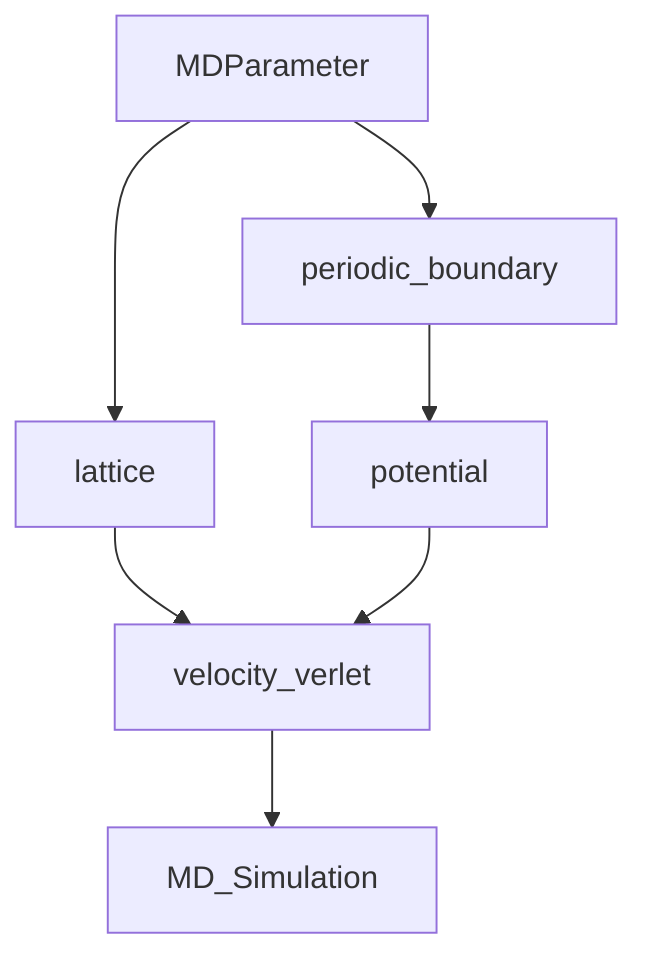

# Molecular_Dynamic_Simulation

## file structure

## Lennad-Jones-Potential

$$
U_{LJ}(r)=4\epsilon [(\frac{\sigma}{r})^{12}-(\frac{\sigma}{r})^6]
$$

$$
F_{LJ}(r)=\frac{4\epsilon}{\sigma} [12(\frac{\sigma}{r})^{13}-6(\frac{\sigma}{r})^7]
$$

$$
F_{LJ}(r_0)=0
$$

$$
r_0=\sqrt[6]{2}\sigma
$$

$$
U_{RLJ}(r)=
  \begin{cases}
    4\epsilon [(\frac{\sigma}{r})^{12}-(\frac{\sigma}{r})^6]+\epsilon       & \quad r\leq r_0\\
    0  & \quad r>r_0
  \end{cases}
$$